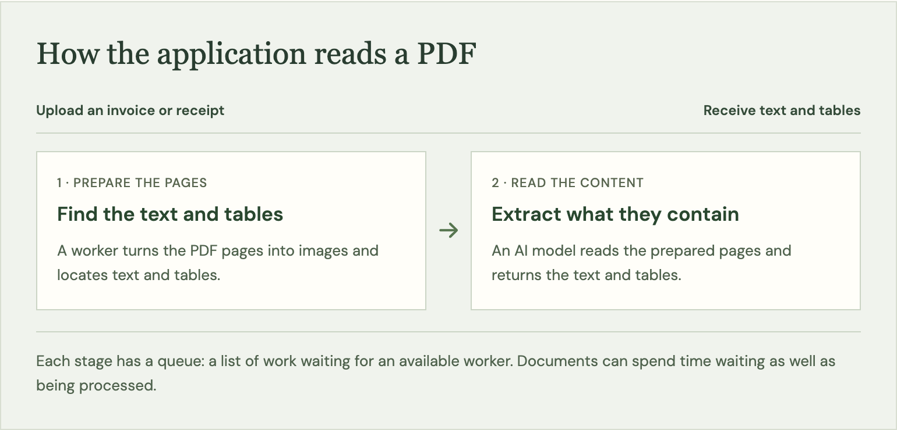

# Can you get 10,000 invoices processed on time?

Run a service that reads PDFs and extracts their contents in OCR Rush, a free AWS architecture game.

An invoice arrives as a PDF, but its contents need to end up in a spreadsheet or accounting system. Someone could open the file and copy the information by hand. A document-processing application can do that reading automatically: you upload the file, and it returns the text and tables for another program to use. Reading text from document images is called optical character recognition, or OCR.

The Neural Maze has [a course that builds this kind of application and shows how to deploy it on AWS](https://theneuralmaze.substack.com/p/deploying-a-production-ocr-system). I built OCR Rush around that application’s AWS services, with some changes that let you explore how it behaves. I recommend taking the course to learn how the application is put together, then using the game to practise running it under different workloads.

Imagine a finance team relying on it to prepare invoices for payment. A few receipts arrive during the morning, then someone uploads a whole batch of invoices before a deadline. The team needs the extracted information in time to use it. Meanwhile, you’re paying for the computers that process the files, including the time they spend switched on with nothing to do.

OCR Rush lets you try the decisions involved in running that service. Across six levels, you choose how much computing capacity to use, when to have it ready, and how the application should deal with interrupted work or damaged files. Then you run the workload and see which documents finished, how long they took and what your setup cost.

There are two main processing stages to keep in mind. First, the application prepares the PDF pages and locates the text and tables. Then an AI model reads that content. Both stages run on computers rented from Amazon Web Services (AWS), using GPUs, processors suited to this kind of AI work. The copies of software doing the processing are called workers. When they’re busy, incoming work waits in a queue until a worker is available. In the game, each stage can take work independently. The course worker keeps a batch until both stages finish; the game’s extra queue lets you explore a different way to organise the processing.

*The game models a queue before each processing stage, so you can see where documents are waiting.*

## Level 1: Control the cost of occasional uploads

Start with a team uploading receipts a few times during the day. The computers finish processing one group, but you don’t know exactly when the next group will arrive. Leaving the GPU computers running costs money through that gap. Shutting them down saves some of that cost, but starting them again takes time.

The person uploading the next receipt experiences that startup as part of their wait. Whether it matters depends on what they need the result for. Someone collecting expenses for a later review can afford to wait longer than someone who needs the extracted information to finish a task now. In the first level, you have to make the cost decision while keeping the required delivery time in mind.

## Level 2: Prepare for a large invoice upload

Now the finance team is sending a batch of invoices together, and you know when it will arrive. That gives you a chance to have the computers ready beforehand. You also have to decide how many documents they should work on at the same time.

This is where “we process a thousand invoices a day” stops being enough information. A thousand arriving throughout the day leave time for the application to catch up between uploads. A thousand arriving together create a line of waiting work. The invoice at the back of that line still has a deadline. Letting more documents run at once can help use the available processing power, but they all share the computers you’re paying for.

## Level 3: Recover from a worker failure

Partway through processing an invoice, one of the workers stops. The upload succeeded, but the result never reached the finance team. They shouldn’t have to discover the missing invoice and submit it again themselves.

For the application to recover, it needs the original file, a record that the work is unfinished, and a way to give that work another attempt. Those are separate responsibilities. Saving the PDF somewhere safe doesn’t, on its own, arrange for it to be processed again.

There is another detail to consider: a client may submit the same invoice again after its result was already saved. That is the second event in this level. Separately, real cloud queues can [deliver the same job more than once](https://docs.aws.amazon.com/AWSSimpleQueueService/latest/SQSDeveloperGuide/standard-queues-at-least-once-delivery.html). If the application publishes another result for the same invoice, the finance team could end up with duplicate records to reconcile. Recovery has to account for what was already completed as well as what still needs doing.

## Level 4: Find the stage that limits throughput

The files get harder: long scans replace the short documents you were handling earlier. A file count doesn’t tell you how much processing that creates. One long PDF may contain more pages than many short invoices combined.

Remember the two stages: preparing the pages, then reading their content. Either can hold up the work. If pages aren’t being prepared quickly enough, extra computers assigned to reading them may have little to do. If prepared pages keep piling up, you have a different problem. Before buying more capacity, you need to see where documents are waiting and which stage is struggling to keep up.

## Level 5: Handle files that cannot be processed

Some of the uploaded PDFs cannot be read. Perhaps a file is damaged. Trying again may help when a worker was interrupted, but it won’t repair that file. The application can spend time attempting it over and over while other documents are still waiting.

The finance team needs a clear answer about those files too. A failed document should remain available for someone to inspect, with enough information to know that it needs attention. AWS queue services support [setting unsuccessful jobs aside for investigation](https://docs.aws.amazon.com/AWSSimpleQueueService/latest/SQSDeveloperGuide/sqs-dead-letter-queues.html). You decide when automatic attempts should stop, while keeping the rest of the upload moving. A retained failure is accounted for; it isn’t a successful extraction.

## Level 6: Complete a 10,000-document import

Finally, you have an entire collection to process: 10,000 documents. You request more workers, but some remain waiting to start. The application has asked for them; that doesn’t mean there are computers available to run them.

The settings for your deployment may allow fewer computers than the workers need. AWS also places [limits on how much computing capacity an account can request](https://docs.aws.amazon.com/ec2/latest/instancetypes/ec2-instance-quotas.html#on-demand-instances), and the machines you want must be available. Until those conditions are met, a higher requested worker count won’t get more invoices processed.

Once the workers can run, both processing stages still need enough capacity. Preparing pages faster won’t finish the import if the reading stage cannot keep up, and the reverse is true too. You now have to manage that balance across a much larger collection, with the delivery requirement and cost visible throughout.

## Try running the service yourself

Each time you replay a level, the same documents arrive and the same failure rules apply. In the recovery level, the interruption waits for a worker with documents in progress, so starting later cannot avoid the test. That makes it easier to judge a change. You can see whether starting the computers earlier helped, whether extra workers reduced the wait, or whether a recovery change allowed an interrupted document to finish.

The game uses simulated processing times and AWS reference prices in USD. The deadlines are requirements for the exercises, and the cost is an estimate of the services included in the simulation. You don’t need an AWS account, and playing creates no cloud charges.

Start with the receipt uploads and work up to the large import. Once you complete a level, share your result and invite someone to meet the same requirements for less.

[**Play OCR Rush →**](https://www.marcelops.com/ocr-rush/)

For questions or discussion, you can find me on [Build With AWS](https://buildwithaws.substack.com/) or [LinkedIn](https://linkedin.com/in/marceloacostacavalero). I regularly share updates about AI systems and AWS architecture patterns.

Build something interesting with this, and then share what you learned!
